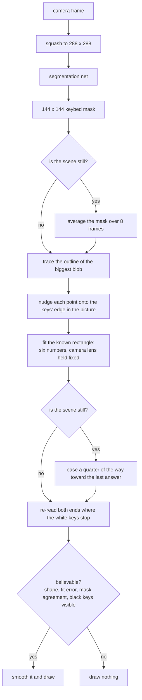

# keybed

A computer vision model, and the browser pipeline around it, that locates the keybed of a
piano or electronic keyboard in a camera image and solves its position and orientation in 3D.

The model is a small semantic segmentation network. It marks which pixels belong to the strip
of white and black keys, and nothing else. On its own that gives you a rough blob, so the
pipeline fits a rectangle of known real world proportions to it, which turns the blob into an
actual pose: where the keyboard is, how it is tilted, and how far away it is.

Everything runs in the browser. There is no server and nothing you record leaves your machine.
It never listens to the music and never tries to work out which notes are being played. It
solves geometry only, and what you get back is a plane you can draw anything onto, in the same
perspective as the original video.

## Run it

```
make install
make model
make dev
```

Then open http://localhost:5273/ and allow the camera. `make model` downloads the trained
weights from Hugging Face, which are not stored in this repo. `make help` lists everything
else.

## How it finds the keyboard

Every frame goes through the same steps. A small neural net looks at the picture and marks
which pixels it thinks are keyboard. That gives a rough blob, not a shape, so the next part
turns it into geometry: trace the outline of the blob, nudge each point onto the nearest
real edge in the picture, then fit a rectangle to it.

The rectangle is the important trick. A piano keyboard is a known shape, 36 white keys wide
and a fixed depth, so instead of hunting for four independent corners the fit only has six
numbers to find, which are the rotation and position of that one rigid rectangle in space.
Every answer it can give is a shape a real keyboard could actually make, which is what stops
the corners wandering off.

When nothing in the scene is moving, it averages the mask over several frames and eases the
new answer toward the one it already had, so a still camera gives a still box instead of a
box that shivers. Finally it checks the answer is believable, and draws nothing at all if it
is not. Showing no box is better than showing a wrong one.



## Train it on your own piano

The model that ships was trained on one instrument in one room, and it will do noticeably
better on your piano if you retrain it on your own pictures. Here is the whole loop.

**1. Make synthetic pictures.** Run `make dev`, open http://localhost:5273/gen.html and click
*auto sweep*. It spins a 3D keyboard through thousands of angles, lighting setups and
backgrounds, saving each frame with exact corner labels into `data/synth/`. Leave it running
for a few minutes. Click *render test grid* once too, which fills `data/grid/` with a fixed
set of poses you can score against later.

**2. Film your real piano.** Open http://localhost:5273/ and point the camera at your
keyboard. Turn on *manual* and drag the four handles onto the corners of the keys yourself.
This part matters, because whatever the handles are sitting on becomes the label. Then press
*rec* for a clip or *snap* for a still. Move the camera and repeat from several angles,
distances and lighting conditions. Everything lands in `data/recordings/`.

**3. Turn the clips into frames.**

```
make lab-extract
```

This reads `data/recordings/` and writes labelled frames into `data/frames/`.

**4. Pack the synthetic set for a GPU.**

```
make lab-corpus-zip
```

This produces `data/keybed-corpus.zip`.

**5. Train.** The shipped model is a MobileNetV3 backbone with a U-Net head, and it is
trained on a GPU using the notebook at `tools/kaggle/keybed-seg2-train.ipynb`. Upload
`data/keybed-corpus.zip` and the `tools/src/kvt/` folder as two Kaggle datasets, attach both
to that notebook, and run it. It saves one checkpoint per epoch.

If you would rather stay on your own machine, `make lab-train-seg` trains the older and
smaller segmentation net locally with no GPU needed. It is less accurate, but the whole loop
works without leaving your laptop.

**6. Pick the best checkpoint.** Download the checkpoints and score each one against the real
frames from step 3:

```
make lab-detect ARGS="--method seg2 --model path/to/seg2-e12.pt"
```

Take the one with the lowest error on the held out split. Synthetic validation scores lie
after the first few epochs, so always choose on real frames.

**7. Ship it.** Copy your winner to `data/models/keybed_seg2.tuned.pt` and run:

```
make lab-export-seg2
```

That writes `web/public/keybed_seg2.onnx`, which is the file the browser loads. Reload the
page and you are running your own model.

**8. Check it did not get worse.** `make lab-jitter` measures how much the box wobbles on a
clip where nothing moves, and `make lab-gridtest` scores accuracy pose by pose against the
render grid from step 1.

## The model

The weights live at [mattf/keybed-seg](https://huggingface.co/mattf/keybed-seg) rather than
in this repo. `make model` fetches them into `web/public/keybed_seg2.onnx`, which is the file
the browser loads. It takes a 288 x 288 RGB image normalised on the usual ImageNet statistics
and returns a 144 x 144 map of how likely each patch is to be keyboard.

## Notes on the data

Recordings stay on your machine. Everything under `data/` is ignored by git on purpose,
because those files are pictures of your room.

## Licence

Apache 2.0, except for `web/public/models/piano_keys.glb`, which is
["Piano keys"](https://sketchfab.com/3d-models/piano-keys-a68d3e1b5fb4463992bdd02f8f4aa4db)
from Sketchfab, used under CC BY. That mesh is what the generator page renders.
